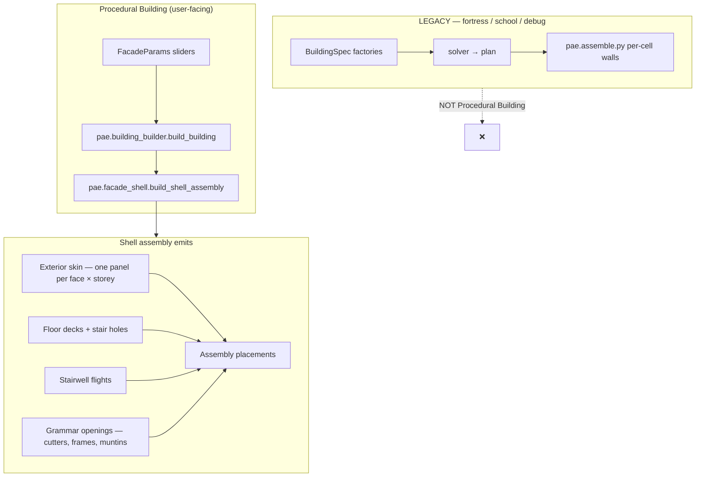

# Procedural Building — `build_building`

One public entry for CITY&BEYOND Georgian townhouses. Everything else is either
an implementation detail or a **different system**.

## Systems (inside vs outside)



| Path | Module | Use |
|------|--------|-----|
| **Procedural Building** | `pae.building_builder.build_building` | Sliders → continuous shell |
| Shell implementation | `pae.facade_shell` | Internal; called only by `building_builder` |
| Slider → spec helpers | `pae.facade_grammar` | `FacadeParams`, `params_to_spec`, JSON export |
| **Legacy modular** | `pae.assemble` + `pae.pipeline` | Fortress, school, gallery, M1 presets |
| **Legacy debug** | `build_from_params(..., mode="modular")` | Per-cell wall farm — not for demos |

**Do not** route Procedural Building through `assemble.py` or modular cell walls.
The shell path uses grammar-cut apertures in a continuous cream skin, not
`wall_window_*` kit modules on exterior faces.

## API

```python
from pae.building_builder import build_building
from pae.facade_grammar import FacadeParams

params = FacadeParams(seed=42, frontage_m=10, depth_m=8, storeys=2, wealth=2)
massing, plan, assembly, report, params = build_building(params)
# massing is None, plan is None — geometry is assembly.placements
```

Optional: `validate_assembly=True` (default) runs `pae.validate.validate`.

## Callers

| Caller | Import |
|--------|--------|
| Blender **Generate Building** (`pae.generate_facade`) | `build_building` |
| `tools/build_georgian_townhouse_blender.py` | `build_building` |
| Thin compat wrapper | `facade_grammar.build_from_params` → delegates to `build_building` when `mode="shell"` |

## Shell contents (what `build_shell_assembly` places)

1. **Exterior skin** — solid wall panel per facade face × storey; party walls blind.
2. **Floors** — ground slab + spanning decks; stair hole cut on upper levels.
3. **Stairwell** — straight or switchback flights from shared stair ids.
4. **Openings** — door/window cutters, frames, muntins punched into the skin (not modular window kits).
5. **Roof + chimneys** — pitched roof shell; optional chimney stubs by wealth.

Regression: `test_shell_has_no_modular_window_kits` in `pae/tests/unit/test_facade_shell.py`.

## Tests

```powershell
pytest pae/tests/unit/test_building_builder.py pae/tests/unit/test_facade_shell.py -q
```
